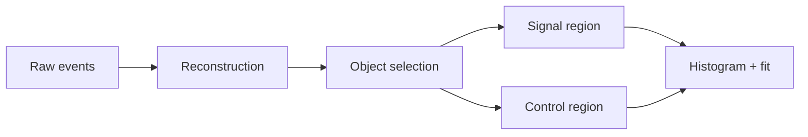
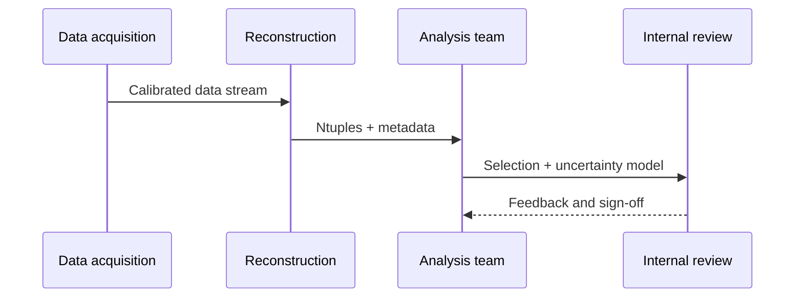

+++
title = "Hextra Features for Physics Lessons"
weight = 55
+++

Use this page for practical, lesson-author-focused Hextra features that are especially useful in particle-physics tutorials.
It complements upstream Hextra docs with domain-shaped examples instead of re-documenting every option.


This page covers the high-value defaults for lesson authors.
For full option matrices and edge cases, use the linked upstream Hextra pages.


## High-value feature map

| Feature | Good fit in physics lessons | Upstream |
| --- | --- | --- |
| LaTeX | equations, symbols, uncertainty notation | [LaTeX](https://imfing.github.io/hextra/docs/guide/latex/) |
| Mermaid | selection flow and collaboration diagrams | [Diagrams](https://imfing.github.io/hextra/docs/guide/diagrams/) |
| Tabs | OS/shell/package-manager variants | [Tabs](https://imfing.github.io/hextra/docs/guide/shortcodes/tabs/) |
| Details | optional derivations and deep dives | [Details](https://imfing.github.io/hextra/docs/guide/shortcodes/details/) |
| FileTree | repository and data layout orientation | [FileTree](https://imfing.github.io/hextra/docs/guide/shortcodes/filetree/) |
| Cards | quick links to key lesson resources | [Cards](https://imfing.github.io/hextra/docs/guide/shortcodes/cards/) |
| Steps | short procedural workflows | [Steps](https://imfing.github.io/hextra/docs/guide/shortcodes/steps/) |
| Syntax highlighting | line numbers and highlighted snippets | [Syntax Highlighting](https://imfing.github.io/hextra/docs/guide/syntax-highlighting/) |

## LaTeX for analysis notation

Inline notation works well for terms like \(p_T\), \(\eta\), and \(\Delta R\).

For standalone equations:

$$
\begin{aligned}
N_{\text{sig}} &= N_{\text{obs}} - N_{\text{bkg}} \\
Z &\approx \frac{N_{\text{sig}}}{\sqrt{N_{\text{bkg}} + (\delta N_{\text{bkg}})^2}}
\end{aligned}
$$

`hugo-styles` enables Goldmark passthrough delimiters so `\(...\)` and `$$...$$` render correctly.

## Mermaid for analysis and teaching flow





## Tabs for setup variants

Use the same labels across tab groups when you want sync behavior.



```bash
python -m venv .venv
source .venv/bin/activate
```


```zsh
python -m venv .venv
source .venv/bin/activate
```


```fish
python -m venv .venv
source .venv/bin/activate.fish
```



## File orientation with FileTree and Cards


  
    
      
      
    
    
      
    
  
  









## Steps and optional depth

{}

### Define the learning objective

Write the specific analysis skill the learner should gain.

### Show the minimal reproducible command path

Keep platform-specific command variants in short tab groups.

### Add one visual summary

Use Mermaid for workflow shape before detailed prose.

### Add one optional deep-dive block

Use `details` for derivations that are useful but not required for first pass.

{}


For quick estimates in counting analyses, \(\sigma_N \approx \sqrt{N}\) is often enough to explain uncertainty propagation in early lesson stages.


## Syntax-highlighted snippets

```python {filename="selection.py",linenos=table,hl_lines=[2,5],linenostart=1}
events = load_events("events.parquet")
selected = events[(events.pt > 25) & (abs(events.eta) < 2.4)]
control = selected[selected.m_ll.between(70, 110)]
signal = selected[selected.m_ll.between(110, 160)]
plot_mass(control, signal)
```

For badge/PDF/video and other utility shortcodes, see [Other Shortcodes](https://imfing.github.io/hextra/docs/guide/shortcodes/others/).
