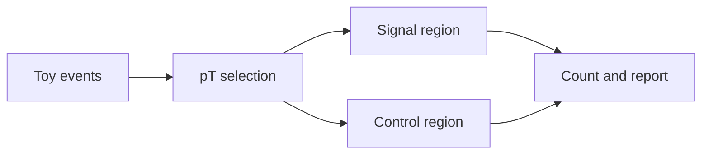
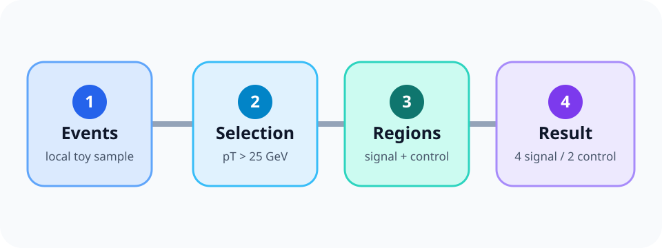

+++
title = "Hextra Feature Guide"
weight = 55
+++

This page is a live, offline-capable showcase of the Hextra features selected for lesson authors. Use the copy button on any code block, and use the **Copy page** menu beside the title to view this page as Markdown.

## Math

Inline notation such as \(p_T > 25\,\mathrm{GeV}\) stays readable in a sentence. Display equations can carry the central result:

$$
Z \approx \frac{N_{\mathrm{sig}}}{\sqrt{N_{\mathrm{bkg}} + (\delta N_{\mathrm{bkg}})^2}}
$$


```md
Inline: \(p_T > 25\,\mathrm{GeV}\)

$$
Z \approx \frac{N_{\mathrm{sig}}}{\sqrt{N_{\mathrm{bkg}} + (\delta N_{\mathrm{bkg}})^2}}
$$
```


## Mermaid diagrams




````md

````


## Synced tabs

Choose a shell here:


`source .venv/bin/activate`
`source .venv/bin/activate.fish`


The matching choice follows in this second group:


`python analysis.py`
`python analysis.py`





bash command
fish command



Enable sync globally, then opt out for a page only when its tab groups are unrelated:

```toml
# hugo.toml
[params.page.tabs]
  sync = true

# page front matter
[tabs]
  sync = false
```


## Details and steps


The toy counts demonstrate the rendering workflow, not a statistical claim.


{}

### Record the input

Name the sample and the expected columns.

### Apply one explicit cut

Keep the first selection easy to reproduce.

### Report counts with context

State the signal and control windows beside the result.

{}




Extra context.


{}
### Record the input
### Apply one explicit cut
### Report counts with context
{}



## Cards, badges, and icons








 analysis-ready













## File tree


  
    
      
    
    
      
        
        
        
      
    
  





  
    
  




## Syntax highlighting and code copy

```python {filename="selection.py",linenos=table,hl_lines=[2,4]}
events = load_events("toy-events.json")
selected = [event for event in events if event.pt > 25]
signal = [event for event in selected if 80 <= event.mass < 100]
print(f"signal={len(signal)}")
```

The copy button in the upper-right corner is enabled automatically.


````md
```python {filename="selection.py",linenos=table,hl_lines=[2,4]}
selected = [event for event in events if event.pt > 25]
```
````


## Image zoom

Click this page-bundle image to enlarge it:




```md

```

Enable the local vendored zoom script globally, with an optional page opt-out:

```toml
# hugo.toml
[params.imageZoom]
  enable = true
  js = "js/vendor/medium-zoom.min.js"

# page front matter
imageZoom = false
```


## Local PDF

[Open or download the handout](particle-analysis-handout.pdf) if the embedded viewer is not convenient.





[Open or download the handout](particle-analysis-handout.pdf).





## Local Jupyter notebook

The code cell and its saved deterministic output render without a notebook server or network request.

{}



{}

Keep the `.ipynb` file in the same page bundle as `index.md`.


## Banner, search, and theme

The dismissible banner at the top identifies this documentation as a live demo. Search is visible in the navigation, and the theme menu offers Light, Dark, and System.


```toml
[params.banner]
  key = "hugo-styles-feature-demo-v1"
  message = "This documentation is a live feature demo. See the [feature guide](/docs/hextra-features/)."

[params.search]
  enable = true
  type = "flexsearch"

[params.theme]
  default = "system"
  displayToggle = true
```
Use a root-relative path for an internal banner link so Hugo applies the site's base path and keeps navigation in the same tab. Changing the banner key makes a revised announcement visible even to readers who dismissed an older one.


## Markdown context menu

Use **Copy page** beside this title, or open its menu to view the exact Markdown source.


```toml
[outputs]
  page = ["HTML", "Markdown"]
  section = ["HTML", "Markdown"]

[params.page.contextMenu]
  enable = true
```

Opt out for one page with `contextMenu = false` in front matter.


## Version selector

The deployed demo builds **Latest** and the archived **v0.4.0** site. Use **Versions** in the navigation to move between them.


```toml
[params.versioning]
  enable = true
  defaultBranch = "main"

  [params.versioning.latest]
    enable = true
    label = "Latest"

  [params.versioning.tags]
    refs = ["v0.4.0"]
```


The curated gallery intentionally leaves out comments/blog features, Hextra's separate data-file term system, include-based content reuse, and CDN-backed terminal recordings. They overlap with this lesson model or weaken the offline build contract.
