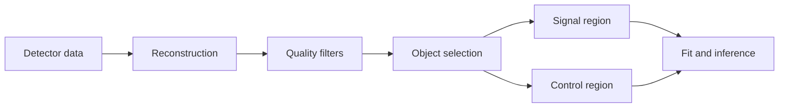
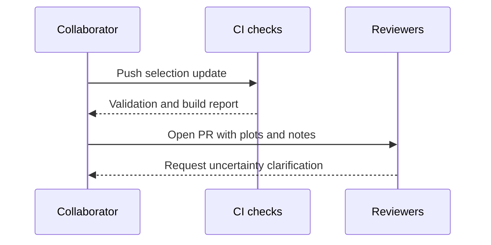

+++
title = "Physics notation, diagrams, and richer docs"
weight = 40
teaching = 20
exercises = 10
questions = ["How can we communicate a particle-physics analysis workflow clearly without custom frontend code?"]
objectives = ["Use LaTeX and Mermaid to express analysis logic and notation directly in lesson content.", "Use Hextra components to keep setup, navigation, and optional depth structured and maintainable."]
keypoints = ["Prefer built-in Hextra features over custom templates for diagrams and notation.", "Use tabs, details, steps, cards, and filetree to separate core path from optional depth."]
+++

This episode demonstrates documentation-focused Hextra features in a particle-physics context.
The goal is to keep source files readable for authors while giving learners clear visual structure.

## LaTeX for physics notation

Inline notation is useful for compact expressions like \(p_T > 25\,\mathrm{GeV}\), \(|\eta| < 2.4\), and \(\Delta R < 0.4\).

A standalone equation block can communicate selection logic and uncertainty estimates more clearly:

$$
\begin{aligned}
N_{\text{sig}} &= N_{\text{obs}} - N_{\text{bkg}} \\
Z &\approx \frac{N_{\text{sig}}}{\sqrt{N_{\text{bkg}} + (\delta N_{\text{bkg}})^2}}
\end{aligned}
$$


Keep first-pass equations close to the learning objective.
Move detailed derivations to optional `details` blocks.


## Mermaid for analysis flow





## Synced tabs for command variants

Use repeated tab labels to keep shell choices synced across blocks.



```bash
hugo server
```


```zsh
hugo server
```


```fish
hugo server
```





```bash
go run github.com/oer-particle-physics/hugo-styles/cmd/hugo-styles-migrate@latest check .
```


```zsh
go run github.com/oer-particle-physics/hugo-styles/cmd/hugo-styles-migrate@latest check .
```


```fish
go run github.com/oer-particle-physics/hugo-styles/cmd/hugo-styles-migrate@latest check .
```



## FileTree and Cards for orientation


  
    
      
      
    
    
      
    
  
  









## Steps plus optional deep dive

{}

### Write the question and objective first

Anchor the episode around one concrete analysis skill.

### Add one core equation and one core diagram

Use LaTeX and Mermaid to keep explanation compact and precise.

### Keep setup variants in tabs

Avoid long repeated command blocks in linear prose.

### Hide advanced context in details blocks

Keep the default reading path short, then let motivated learners expand.

{}


For two reconstructed leptons, \(m_{\ell\ell}^2 = (E_1 + E_2)^2 - \lVert \vec{p}_1 + \vec{p}_2 \rVert^2\).  
Use this as context when explaining mass-window selection.



Add one Mermaid flowchart and one LaTeX equation to a new episode page that explains a toy signal-vs-background workflow.


Start with only four stages: reconstruction, quality filters, signal region, control region.



Keep the first version minimal: one flowchart, one equation for \(Z\) or a counting estimate, and one optional `details` block for background theory.


